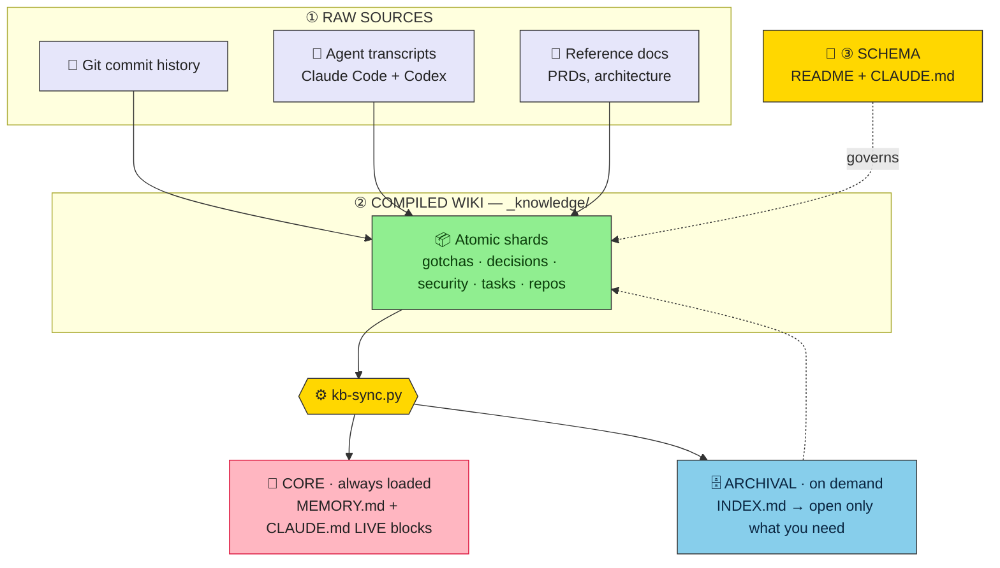

<div align="center">

# 🧠 agent-kb

**Give any project a durable, agent-maintained knowledge base.**

Plain markdown · git-versioned · two-tier memory — the thing that lets an AI coding agent
*remember* the gotchas, decisions, and prod caveats that die with the context window.

[](LICENSE.md)
[](https://github.com/karrvel/agent-kb/releases/latest)
[](https://www.python.org/)
[](#whats-inside)

<sub>Karpathy <em>LLM-wiki</em> + MemGPT/Letta two-tier memory · fact-checked · impact-measured</sub>

</div>

---

## Why

An AI coding agent forgets everything between sessions. What hurts most to lose isn't in the code —
it's **off-code tribal knowledge**: *"this env var breaks with a trailing slash," "that liveness
check is cosmetic," "these rate limits were loosened on the box and aren't in git."* `grep` can't
recover it, and re-reading the repo can't either.

This kit compiles that knowledge **once** into a browsable markdown wiki that compounds across
sessions. The load-bearing research conclusion: below **~150–200 pages / ~50–100k tokens**, a
plain-markdown index plus the context window retrieves more reliably than embeddings — and stays
diff-able, greppable, and human-editable. Skip vector RAG until you outgrow it.

## How it works

Three layers (Karpathy) over two memory tiers (MemGPT):



## What's inside

Stdlib-only Python 3 — no dependencies, nothing to install.

| | |
|---|---|
| **`template/`** | the vault scaffold you copy in as `_knowledge/` |
| **`tooling/`** | `kb-sync` (shards → navigation + memory) · `kb-lint` (schema gate) · `kb-fix` (Obsidian-safe frontmatter) · `kb-links` (link-rot gate) · `kb-staleness` (re-verify queue) · `kb-update` (pull new versions) · `prefilter` (transcripts → digests) · `hooks/` · `kb-eval/` |
| **`setup/`** | ready `.gitignore` for each layout below |
| **`research/`** | the fact-checked *why* |
| **Docs** | [HOWTO](HOWTO.md) · [AGENTS](AGENTS.md) · [CHANGELOG](CHANGELOG.md) · [SECURITY](SECURITY.md) · [LICENSE](LICENSE.md) |

The vault is plain markdown with `[[wikilinks]]` — open `_knowledge/` in
**[Obsidian](https://obsidian.md)** for graph view, backlinks and full-text search. No plugins.

---

## Choose your setup

| | **Option A — Workspace** | **Option B — Embedded** |
|---|---|---|
| **Shape** | wrapper dir; git tracks *only* the vault | vault lives inside your project's repo |
| **Projects** | many, under `repos/`, each its own git | one |
| **Best for** | several related repos sharing one KB | a single project, KB travels with the code |
| **`.gitignore`** | `cp "$KIT/setup/workspace.gitignore" .gitignore` | append `setup/embedded.gitignore` to yours |

Both assume you cloned the kit into `$KIT` (step 0 of [Quick start](#quick-start)).

<table>
<tr><th>Option A — Workspace</th><th>Option B — Embedded</th></tr>
<tr><td><pre>~/my-workspace/
├── _knowledge/   ← tracked (the vault)
├── _meta/        ← kit scripts, untracked
├── repos/
│   ├── project-one/   ← own git
│   └── project-two/   ← own git
├── CLAUDE.md     ← tracked
├── AGENTS.md     ← tracked, generated
├── GEMINI.md     ← tracked, generated
└── .githooks/    ← tracked</pre></td>
<td><pre>~/Projects/my-project/
├── _knowledge/   ← tracked with your code
├── _meta/        ← kit scripts, gitignored
├── src/          ← your code
├── CLAUDE.md     ← tracked
├── AGENTS.md     ← generated
├── GEMINI.md     ← generated
└── .cursor/rules/kb-context.mdc
                  ← generated</pre></td></tr>
</table>

### Option B — Embedded (KB lives inside an existing project)

> [!IMPORTANT]
> `kb-sync` **owns** three files at your project root: `AGENTS.md`, `GEMINI.md`,
> `.cursor/rules/kb-context.mdc`. A hand-written root `AGENTS.md` is a common convention in exactly
> these repos — if one already exists and kb-sync didn't generate it, kb-sync **warns, skips it and
> continues** (exit 0). Two remedies, only two: **rename/move your file**, or **drop that platform
> from `KB_PLATFORMS`**. Do **not** paste the generated block into your own file — it opens with
> kb-sync's ownership marker, so the next run would adopt and overwrite it.

> [!NOTE]
> **For collaborators.** `_meta/` is gitignored and `core.hooksPath` is per-clone *local* config, so
> a teammate who clones gets **no tooling and no gate** — and an ungated commit can land an invalid
> shard that blocks everyone else. Each contributor runs this once:
> ```bash
> KIT=$(mktemp -d) && git clone --depth 1 https://github.com/karrvel/agent-kb.git "$KIT" \
>   && mkdir -p _meta && cp "$KIT"/tooling/*.py "$KIT"/tooling/*.sh _meta/ \
>   && git config core.hooksPath .githooks
> ```

---

## Quick start

```bash
# 0. Clone into a fresh dir — never a fixed /tmp path (a stale clone installs a stale kit)
KIT=$(mktemp -d) && git clone --depth 1 https://github.com/karrvel/agent-kb.git "$KIT"
cd <your-root>

# 1. Vault scaffold + scripts + hook
cp -R "$KIT/template" ./_knowledge
mkdir -p ./_meta      && cp "$KIT"/tooling/*.py "$KIT"/tooling/*.sh ./_meta/
mkdir -p ./.githooks  && cp "$KIT/tooling/hooks/pre-commit" ./.githooks/
chmod +x ./.githooks/pre-commit
git config core.hooksPath .githooks     # ⚠ see below if this repo already has hooks

# 2. Wire the always-loaded tier (see the CLAUDE.md block below), fill in
#    _knowledge/README.md ({PROJECT}/TODO), then generate navigation:
python3 _meta/kb-sync.py && python3 _meta/kb-fix.py \
  && python3 _meta/kb-lint.py && python3 _meta/kb-links.py
```

<details>
<summary><b>Step 2 — the <code>CLAUDE.md</code> block</b> (without it the LIVE tier is never wired, and every gate still exits 0)</summary>

Re-runnable; it won't append a second marker pair.

```bash
grep -q 'BEGIN:sync:live-security' CLAUDE.md 2>/dev/null || cat >> CLAUDE.md <<'EOF'

> **First action every session:** read `_knowledge/INDEX.md`.

### 🔴 LIVE — open security findings
<!-- BEGIN:sync:live-security -->
<!-- END:sync:live-security -->
### 🟠 LIVE — open work
<!-- BEGIN:sync:open-work -->
<!-- END:sync:open-work -->
EOF
```

</details>

<details>
<summary><b>⚠ If your repo already has git hooks</b> — <code>core.hooksPath</code> silently disables every one of them</summary>

`core.hooksPath` **replaces** `.git/hooks` wholesale, so pre-commit frameworks and secret scanners
stop running with no message. While it's set, anything in `.git/hooks/` is inert — chaining or
symlinking *there* fixes nothing. Skip that line in step 1 and run:

```bash
# undo step 1's config if you already ran it (a pre-existing value like Husky's is left alone):
HP=$(git config core.hooksPath)
[ "$HP" = .githooks ] && { git config --unset core.hooksPath; HP=; }

if [ -n "$HP" ]; then
  echo "core.hooksPath=$HP — .git/hooks/ is inert; CHAIN the gate from $HP/pre-commit:"
  echo '  . "$(git rev-parse --show-toplevel)"/.githooks/pre-commit'
elif [ -e .git/hooks/pre-commit ]; then
  echo "pre-commit hook already exists — CHAIN the KB gate: append this line to it"
  echo '  . "$(git rev-parse --show-toplevel)"/.githooks/pre-commit'
else
  ln -sf ../../.githooks/pre-commit .git/hooks/pre-commit
fi
```

Both `echo` branches only *tell you* what to add — they deliberately don't edit your hook.
**Until that line is actually in the hook they name, the KB gate is not running.**

</details>

**`KB_PLATFORMS`** picks which context files get written — comma-separated, default
`claude,codex,gemini,cursor`, spaces tolerated: `claude` → `MEMORY.md` **and** the `CLAUDE.md` LIVE
blocks · `codex` → `AGENTS.md` · `gemini` → `GEMINI.md` · `cursor` → `.cursor/rules/kb-context.mdc`.
kb-sync reads it from its own environment, so export it —
`KB_PLATFORMS=claude,gemini python3 _meta/kb-sync.py`. Setting it in `.githooks/kb.env` only affects
hook-triggered runs. Drop `codex`, `gemini` or `cursor` *after* its file was generated and that file
stays on disk, frozen at old content — kb-sync warns about the orphan (never deletes it) until you
delete it yourself or re-enable the platform.

Full brownfield method — mining git history, transcripts and existing docs: **[HOWTO.md](HOWTO.md)**.

---

## Agent initialization

Give the prompt below to an agent (Claude Code / Codex) **inside the project you want to document**.
It mines git history, past agent sessions and existing docs, then writes atomic shards and wires
both memory tiers.

<details>
<summary><b>📋 Click to copy the agent initialization prompt</b></summary>

````text
Set up a durable, agent-maintained knowledge base in THIS project using the agent-kb kit.

1. Clone the kit into a FRESH dir (never a fixed /tmp path — a leftover clone installs a stale
   kit) and copy its parts in:
     KIT=$(mktemp -d) && git clone --depth 1 https://github.com/karrvel/agent-kb.git "$KIT" \
       && cp -R "$KIT/template" ./_knowledge \
       && mkdir -p ./_meta && cp "$KIT"/tooling/*.py "$KIT"/tooling/*.sh ./_meta/ \
       && mkdir -p ./.githooks && cp "$KIT/tooling/hooks/pre-commit" ./.githooks/ \
       && chmod +x ./.githooks/pre-commit

   SETUP OPTION — pick one based on this project's layout:
   • Workspace (multiple repos under one root): cp "$KIT/setup/workspace.gitignore" .gitignore
   • Embedded (KB inside an existing project):
       { printf '\n'; cat "$KIT/setup/embedded.gitignore"; } >> .gitignore

2. Read "$KIT/HOWTO.md" and ./_knowledge/README.md — the method and the schema.

3. Edit ./_knowledge/README.md: replace {PROJECT} and TODO with this project's name + date.

4. CREATE the project-root CLAUDE.md if it doesn't exist (kb-sync only warns and skips when it's
   missing — the always-loaded tier stays unwired while every gate still exits 0). It needs
   "First action every session: read _knowledge/INDEX.md" at the top, plus these two marker pairs:
     ### 🔴 LIVE — open security findings
     <!-- BEGIN:sync:live-security -->
     <!-- END:sync:live-security -->
     ### 🟠 LIVE — open work
     <!-- BEGIN:sync:open-work -->
     <!-- END:sync:open-work -->

5. MINE GIT COMMIT HISTORY — free, fast, no LLM tokens, do this first:
     git log --oneline | head -100
     git log --format="%ad %h %s%n%b" --date=short --since="6 months ago"
     git log --pretty=format: --name-only | grep -v '^$' | sort | uniq -c | sort -rn | head -30
   Look for: fix/bug/revert/workaround → gotcha shards. decision/choose/switch/instead of →
   decision shards. Incident responses or large refactors → architecture/security shards.
   Tag provenance as `provenance: git:<short-hash> <date>`.

6. MINE PAST AGENT SESSIONS — highest-value source of off-code tribal knowledge:
     • Claude Code: ~/.claude/projects/<this-cwd-with-slashes-as-dashes>/*.jsonl
     • Codex:       ~/.codex/sessions/
   Distill (strips ~95–98% tool-call noise):
     python3 ./_meta/prefilter.py --match <project-keyword> --out ./_kb-digests
   Recency-weight: fully distill recent sessions; skip old analysis runs already in docs. Log skips.

7. SEED FROM CODE AND DOCS:
   • EMPTY / FRESH: minimal skeleton — architecture.md stub, one repos/ shard per planned
     component, decisions/ for choices already made. Don't invent detail that doesn't exist yet.
   • BROWNFIELD: build skeleton from existing docs (PRDs, READMEs, architecture) into reference/
     + repos/ shards. VERIFY every claim against current code; correct stale docs.

8. Write ATOMIC shards (one fact each) with full frontmatter (see _SHARD_TEMPLATE.md): name,
   type, title, area, tags, status, updated, volatility, provenance. Tag volatility honestly
   (durable | decays-with-code | one-shot). Prefer 0 shards over noise. NEVER put secrets here.

9. Generate navigation + memory tiers, then gate quality:
     python3 ./_meta/kb-sync.py && python3 ./_meta/kb-fix.py \
       && python3 ./_meta/kb-lint.py && python3 ./_meta/kb-links.py && python3 ./_meta/kb-staleness.py
   kb-sync owns AGENTS.md, GEMINI.md and .cursor/rules/kb-context.mdc at the project root; if one
   already exists and wasn't generated by kb-sync it is skipped with a warning and the run still
   exits 0. Report that warning and let the user rename/move the file, or drop that platform from
   KB_PLATFORMS. NEVER paste the generated block into their own file — it carries kb-sync's
   ownership marker, so the next run would overwrite the whole file.
   KB_PLATFORMS (default claude,codex,gemini,cursor) maps: claude → MEMORY.md + the CLAUDE.md LIVE
   blocks · codex → AGENTS.md · gemini → GEMINI.md · cursor → .cursor/rules/kb-context.mdc. kb-sync
   reads it from the environment, so: KB_PLATFORMS=claude,gemini python3 ./_meta/kb-sync.py —
   .githooks/kb.env only covers hook-triggered runs.

10. If this is a git repo, enable the pre-commit health gate — but LOOK FIRST, because
    core.hooksPath replaces .git/hooks entirely and disables any hooks the project already had
    (and while it is set, nothing you put in .git/hooks/ runs at all):
      git config core.hooksPath   # prints a path (e.g. Husky's .husky)? put the gate in THAT dir
      ls -l .git/hooks/pre-commit # exists? CHAIN, never overwrite: append to that hook the line
                                  #   . "$(git rev-parse --show-toplevel)"/.githooks/pre-commit
    Only if both come back empty is it safe to pick one:
      ln -sf ../../.githooks/pre-commit .git/hooks/pre-commit   # or: git config core.hooksPath .githooks
    Until the chain line is in place (or the symlink/config is set), the KB gate is NOT running —
    say so explicitly in your report rather than assuming it is installed.

Report: shards created per collection, what you mined from git history and sessions, what you
verified against code, and what you deliberately skipped. Keep the always-loaded core tiny (~30 items).
````

</details>

See [AGENTS.md](AGENTS.md) for agents landing *inside this kit repo*.

---

## Maintenance

```bash
python3 _meta/kb-sync.py && python3 _meta/kb-fix.py \
  && python3 _meta/kb-lint.py && python3 _meta/kb-links.py && python3 _meta/kb-staleness.py
```

The pre-commit hook runs four stages automatically on staged `_knowledge/` files: **kb-fix**
(auto-fix, never blocks) → **kb-lint** (blocks) → **kb-links** (blocks) → **kb-sync `--check`**
(advisory). Put `kb-staleness` on a pre-session or weekly nudge — re-verifying `decays-with-code`
shards is the discipline everyone skips.

## Updating the kit

See **[CHANGELOG.md](CHANGELOG.md)** for what changed, then:

```bash
python3 _meta/kb-update.py          # interactive — diff per script, prompt before each
python3 _meta/kb-update.py --yes    # silent — warning + 8s countdown, then overwrites
python3 _meta/kb-update.py --check  # dry run — read-only, exit 1 if updates exist
python3 _meta/kb-update.py --main       # track the development tip instead of a release
python3 _meta/kb-update.py --ref v0.5   # pin to an explicit tag, branch or sha
```

By default it updates to the **newest release tag** — versions are ordered numerically, so `v0.10`
outranks `v0.9`, and non-version tags are ignored. A repo with no release tags falls back to the
default branch with a one-line note. The run header prints the ref it used. Only the top-level
`tooling/*.py` in `_meta/` are updated — not the `*.sh` helpers, not `hooks/`, not `kb-eval/`.
Your `_knowledge/` vault is never touched.

> [!WARNING]
> Silent mode skips the diff review. Run interactive at least once on a new version before using
> `--yes` in automation — script changes can affect how secrets and paths are handled.

<details>
<summary>Installed before v0.5? One-time bootstrap to get <code>kb-update.py</code> itself</summary>

```bash
KIT=$(mktemp -d) && git clone --depth 1 https://github.com/karrvel/agent-kb.git "$KIT" \
  && cp "$KIT/tooling/kb-update.py" _meta/
```

</details>

---

## Measured impact

Controlled A/B — same agent with vs without the vault, blinded LLM grading:

| Question type | n | with KB | without KB | Δ |
|---|--:|--:|--:|--:|
| **Overall** | **16** | **100%** | **31%** | **+69 pts** |
| single-fact | 12 | 100% | 33% | +67 |
| multi-hop reasoning | 2 | 100% | 0% | +100 |
| synthesis / summary | 1 | 100% | 0% | +100 |
| abstention (no hallucination) | 1 | 100% | 100% | +0 ✓ |

> **Honest caveat.** 16 questions across one operator's three real codebases, single judge model —
> directional evidence, not a public benchmark. The wins concentrate exactly where a KB should help
> (project-specific, off-code, multi-hop knowledge) with no hallucination penalty.

Scrubbed breakdown and a sample trap: [`tooling/kb-eval/sample-report.md`](tooling/kb-eval/sample-report.md).
Reproduce it on your own vault: [`tooling/kb-eval/`](tooling/kb-eval/).

## When to use it

✅ Single-curator vault under **~150–200 pages / ~50–100k tokens**.

❌ Above that ceiling, or multi-tenant / heavily time-varying corpora needing fuzzy semantic recall
— keep the wiki as the human-legible source of truth and add vector (GraphRAG/RAPTOR) or
temporal-graph retrieval *on top*. Don't reach for a vector DB below the ceiling; it's curation tax.

## License & security

MIT — © 2026 karrvel. See **[LICENSE.md](LICENSE.md)**.

Keep real vaults in **private** repos, never commit secrets, and treat distillates carefully —
full handling rules in **[SECURITY.md](SECURITY.md)**.
