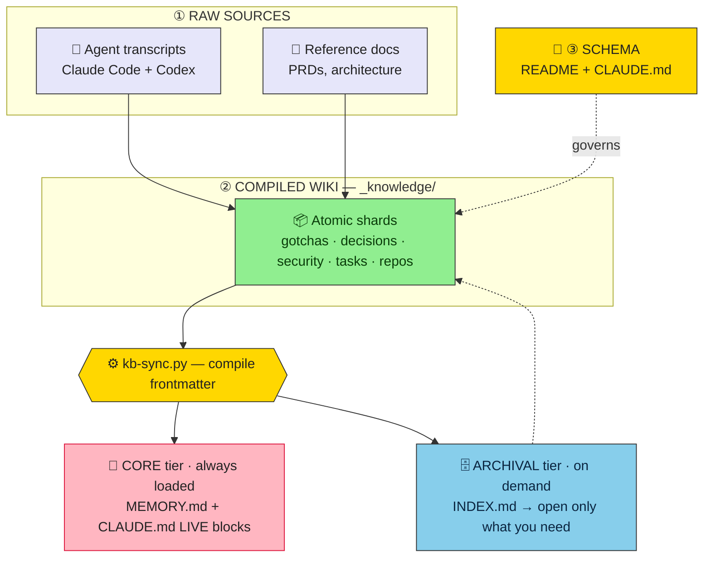
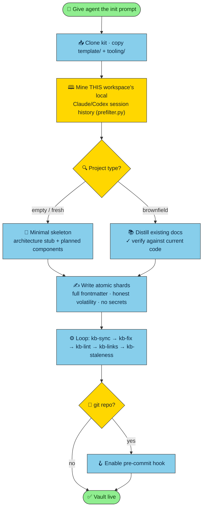

<div align="center">

# 🧠 kb-template

**Give any project a durable, agent-maintained knowledge base.**

Plain markdown · git-versioned · two-tier memory — the thing that lets an AI coding agent *remember*
across sessions the gotchas, decisions, and prod caveats that die with the context window.

<sub>Karpathy *LLM-wiki* + MemGPT/Letta two-tier memory · fact-checked · impact-measured</sub>

</div>

> [!IMPORTANT]
> **Proprietary & confidential.** © 2026 karrvel. No use, copying, or distribution without the
> author's written consent — see [LICENSE.md](LICENSE.md). Knowledge vaults built with this kit can
> describe internal systems and security findings; keep them private.

---

## Contents

- [Why](#why) · [How it works](#how-it-works) · [What's inside](#whats-inside)
- [Quick start (humans)](#quick-start-humans) · [Browse in Obsidian](#browse-in-obsidian) · [For agents (initialization)](#for-agents--initialization)
- [Maintenance loop](#maintenance-loop) · [Measured impact](#measured-impact) · [When to use it](#when-to-use-it)

## Why

An AI coding agent forgets everything between sessions. The knowledge that hurts most to lose isn't in
the code — it's **off-code tribal knowledge**: "this env var breaks with a trailing slash," "that
liveness check is cosmetic," "these rate limits were loosened on the box and aren't in git." `grep`
can't recover it; re-reading the repo can't recover it. This kit compiles that knowledge, **once**,
into a browsable markdown wiki that compounds across sessions.

The design rests on a fact-checked research pass (`research/`) with one load-bearing conclusion:

> [!TIP]
> Build a **two-tier plain-markdown wiki**. Skip vector RAG until you outgrow **~150–200 pages /
> ~50–100k tokens**. Below that ceiling, an index file + the context window retrieve more reliably
> than embeddings — and stay diff-able, greppable, and human-editable.

## How it works

Three layers (Karpathy) over two memory tiers (MemGPT): raw sources compile into atomic shards;
`kb-sync.py` turns shard frontmatter into navigation plus a tiny always-loaded core and a
browse-on-demand archive.



## What's inside

```
kb-template/
├── research/     WHY  — the fact-checked rationale (portable to any project)
├── template/     WHAT — the vault scaffold to copy into a project as _knowledge/
├── tooling/      HOW  — the scripts + the pre-commit hook + the impact eval
│   ├── prefilter.py   transcripts → digests      kb-sync.py     shards → navigation + memory
│   ├── kb-lint.py     schema gate                kb-fix.py      Obsidian-safe frontmatter
│   ├── kb-links.py    link-rot gate              kb-staleness.py  the re-verify queue
│   ├── hooks/         pre-commit gate (+advisory)  kb-eval/     measure KB impact (A/B)
├── HOWTO.md      the build playbook · AGENTS.md   for agents working inside the kit
└── LICENSE.md    proprietary license
```

## Quick start (humans)

```bash
cp -R  kb-template/template        /path/to/project/_knowledge
mkdir -p /path/to/project/_meta && cp kb-template/tooling/*.py /path/to/project/_meta/
cd /path/to/project
# edit _knowledge/README.md ({PROJECT}/TODO) and add the two LIVE markers to your CLAUDE.md (HOWTO §6)
python3 _meta/kb-sync.py && python3 _meta/kb-fix.py && python3 _meta/kb-lint.py && python3 _meta/kb-links.py
```

Full method (distilling a brownfield codebase + transcripts): **[HOWTO.md](HOWTO.md)**.

## Browse in Obsidian

The vault is plain markdown with `[[wikilinks]]`, so it's a first-class **[Obsidian](https://obsidian.md)**
vault — as a human, just open the `_knowledge/` folder in Obsidian to read and navigate it. You get:

- **🕸️ Graph view** — a visual map of how shards connect. Clusters reveal subsystems; stray dots are
  orphaned or dead-linked shards (the same rot `kb-links` catches, but now you can *see* it).
- **🔗 Backlinks & tags** — every shard that references the one you're reading, and filtering by the
  `area` / `tags` frontmatter.
- **🔎 Instant full-text search** across the whole vault.

> [!NOTE]
> No plugins required, and nothing about the format is Obsidian-specific — the same files stay
> greppable, diff-able, and agent-readable outside it. Obsidian is just a nice lens for humans.

## For agents — initialization

Give the prompt below to an agent (Claude Code / Codex) **inside the project you want to document**.
It handles empty/fresh and brownfield projects, and — critically — **mines the project's own past
agent-session history** to recover knowledge that would otherwise be lost.



<details>
<summary><b>📋 Click to copy the agent initialization prompt</b></summary>

````text
Set up a durable, agent-maintained knowledge base in THIS project using the kb-template kit.

1. Clone the kit and copy its parts in (use SSH if the repo is private):
     git clone --depth 1 git@github.com:karrvel/kb-template.git /tmp/kb-template
     cp -R /tmp/kb-template/template ./_knowledge
     mkdir -p ./_meta && cp /tmp/kb-template/tooling/*.py ./_meta/
     mkdir -p ./.githooks && cp /tmp/kb-template/tooling/hooks/pre-commit ./.githooks/ \
       && chmod +x ./.githooks/pre-commit

2. Read /tmp/kb-template/HOWTO.md and ./_knowledge/README.md — the method and the schema. Follow them.

3. Edit ./_knowledge/README.md: replace {PROJECT} and TODO with this project's name + date.

4. Ensure a project-root CLAUDE.md exists with, at the top, "First action every session: read
   _knowledge/INDEX.md", and these two marker pairs:
     ### 🔴 LIVE — open security findings
     <!-- BEGIN:sync:live-security -->
     <!-- END:sync:live-security -->
     ### 🟠 LIVE — open work
     <!-- BEGIN:sync:open-work -->
     <!-- END:sync:open-work -->

5. MINE THIS PROJECT'S OWN PAST AGENT SESSIONS — the single highest-value, project-specific source.
   Locally saved chat history for THIS workspace usually holds gotchas, decisions, security findings,
   and prod caveats that exist nowhere in the code:
     • Claude Code: ~/.claude/projects/<this-cwd-with-each-slash-as-a-dash>/*.jsonl
       (e.g. cwd /Users/me/app  →  ~/.claude/projects/-Users-me-app/)
     • Codex:       ~/.codex/sessions/
   Distill them (strips ~95–98% tool-call noise, buckets by cwd):
     python3 ./_meta/prefilter.py --match <project-keyword> --out ./_kb-digests
   Read the digests and turn the DURABLE findings into shards. Recency-weight (fully distill recent
   sessions; skip old codebase-analysis runs already captured in docs). Log what you skip.

6. Seed the rest from the code/docs:
   • EMPTY / FRESH (little or no code yet): a MINIMAL skeleton — an architecture.md stub, one repos/
     shard per planned component, decisions/ shards for choices already made. Grow it as the project
     grows; don't invent detail that doesn't exist yet.
   • BROWNFIELD (existing code): build the skeleton from existing docs (PRDs, READMEs, architecture)
     into reference/ + repos/ shards, VERIFYING every claim against the current code and correcting
     stale docs.

7. Write ATOMIC shards (one fact each) with full frontmatter (see _SHARD_TEMPLATE.md): name, type,
   title, area, tags, status, updated, volatility, provenance. Tag volatility honestly (durable |
   decays-with-code | one-shot). Prefer 0 shards over noise. NEVER put secrets in the vault.

8. Generate navigation + the two memory tiers, then gate quality:
     python3 ./_meta/kb-sync.py && python3 ./_meta/kb-fix.py \
       && python3 ./_meta/kb-lint.py && python3 ./_meta/kb-links.py && python3 ./_meta/kb-staleness.py

9. If this project is a git repo, enable the pre-commit health gate:
     git config core.hooksPath .githooks

Report: shards created per collection, what you mined from past sessions, what you verified against
code, and what you deliberately skipped. Keep the always-loaded core tiny (~30 items).
````

</details>

See [AGENTS.md](AGENTS.md) for agents landing *inside this kit*.

## Maintenance loop

After editing shards, run — in order:

```bash
kb-sync   →   kb-fix   →   kb-lint   →   kb-links   →   kb-staleness
```

> [!NOTE]
> Put `kb-fix` + `kb-lint` + `kb-links` in a **pre-commit hook** (`tooling/hooks/pre-commit`); put
> `kb-staleness` on a **pre-session / weekly** nudge. Re-verifying `decays-with-code` shards is the
> discipline everyone skips — automate it, don't rely on willpower. See [tooling/README.md](tooling/README.md).

## Measured impact

The kit's value was measured, not asserted — a controlled A/B (agent *with* the vault vs *without*),
blinded grading, across two independent judges:

| Question type | with KB | without KB | Δ |
|---|--:|--:|--:|
| **Overall** | **100%** | **31%** | **+69 pts** |
| single-fact | 100% | 33% | +67 |
| multi-hop reasoning | 100% | 0% | +100 |
| synthesis / summary | 100% | 0% | +100 |
| abstention (no hallucination) | 100% | 100% | +0 ✓ |

The wins concentrate exactly where a KB should help — project-specific, off-code, multi-hop
knowledge — with no hallucination penalty. Reproduce it: `tooling/kb-eval/`.

## When to use it

> [!WARNING]
> This is the right tool for a **single-curator vault under ~150–200 pages / ~50–100k tokens**. Above
> that — or for multi-tenant, heavily time-varying corpora needing fuzzy semantic recall — keep the
> wiki as the human-legible source of truth but add vector (GraphRAG/RAPTOR) or temporal-graph
> retrieval *on top*. Don't reach for a vector DB below the ceiling; it's curation tax.

## Privacy & license

Proprietary and confidential — © 2026 karrvel, all rights reserved. See **[LICENSE.md](LICENSE.md)**.
Keep real vaults in **private** repos, never commit secrets, and treat distillates as confidential.
The impact eval keeps secret-bearing traps in a git-ignored `traps.local.jsonl`; only a redacted
example ships.
