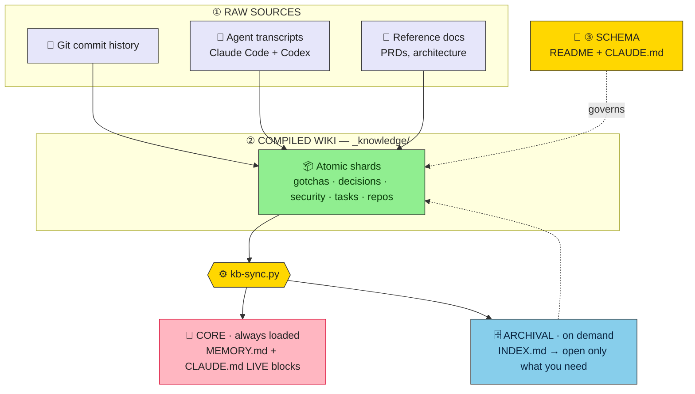

<div align="center">

# 🧠 kb-template

**Give any project a durable, agent-maintained knowledge base.**

Plain markdown · git-versioned · two-tier memory — the thing that lets an AI coding agent *remember*
across sessions the gotchas, decisions, and prod caveats that die with the context window.

<sub>Karpathy *LLM-wiki* + MemGPT/Letta two-tier memory · fact-checked · impact-measured</sub>

</div>

---

## Why

An AI coding agent forgets everything between sessions. The knowledge that hurts most to lose isn't
in the code — it's **off-code tribal knowledge**: "this env var breaks with a trailing slash," "that
liveness check is cosmetic," "these rate limits were loosened on the box and aren't in git." `grep`
can't recover it. This kit compiles that knowledge, **once**, into a browsable markdown wiki that
compounds across sessions.

The research conclusion: **below ~150–200 pages / ~50–100k tokens, a plain-markdown index + context
window retrieves more reliably than embeddings** — and stays diff-able, greppable, and human-editable.
Skip vector RAG until you outgrow it.

## How it works

Three layers (Karpathy) over two memory tiers (MemGPT):



## What's inside

```
kb-template/
├── setup/        starter .gitignore files for each setup option (see below)
├── research/     WHY  — the fact-checked rationale
├── template/     WHAT — the vault scaffold (copy this into your project as _knowledge/)
├── tooling/      HOW  — the scripts, pre-commit hook, and impact eval
│   ├── prefilter.py    transcripts → digests     kb-sync.py      shards → navigation + memory
│   ├── kb-lint.py      schema gate               kb-fix.py       Obsidian-safe frontmatter
│   ├── kb-links.py     link-rot gate             kb-staleness.py re-verify queue
│   ├── kb-update.py    pull new kit versions     kb-eval/        measure KB impact (A/B)
│   └── hooks/          pre-commit gate
├── HOWTO.md      the build playbook
├── AGENTS.md     for agents working inside the kit
└── SECURITY.md   handling sensitive vaults  ·  LICENSE.md  MIT license
```

The vault is plain markdown with `[[wikilinks]]` — open `_knowledge/` in **[Obsidian](https://obsidian.md)** for graph view, backlinks, and full-text search. No plugins required.

---

## Choose your setup

Two ways to use this kit. Pick one before running the quick start.

### Option A — Workspace (one KB for multiple projects)

A standalone wrapper directory whose git tracks **only** the vault. Your actual projects live under
`repos/` as their own self-contained git repos.

```
~/my-workspace/
├── _knowledge/        ← git tracks only this (the vault)
├── _meta/             ← kit scripts, untracked (disposable copy)
├── repos/
│   ├── project-one/   ← its own git repo
│   └── project-two/   ← its own git repo
├── CLAUDE.md          ← tracked
└── .githooks/         ← tracked (pre-commit gate)
```

**When to use:** you work across several related repos and want one shared KB for all of them. This
is the recommended setup for a team workspace or a mono-developer who juggles multiple services.

```bash
mkdir ~/my-workspace && cd ~/my-workspace
git init
cp /tmp/kb-template/setup/workspace.gitignore .gitignore
```

### Option B — Embedded (KB lives inside an existing project)

The vault lives alongside your project's source code, tracked by the project's own git. No wrapper
directory needed — just drop it in.

```
~/Projects/my-project/
├── _knowledge/        ← tracked by the project's own git
├── _meta/             ← kit scripts, gitignored
├── src/               ← your code (tracked as normal)
└── CLAUDE.md          ← tracked
```

**When to use:** you have a single project with its own repo and want the KB to travel with it,
visible to all contributors, versioned in the same history.

```bash
cd ~/Projects/my-project   # your existing project repo
# append the embedded exclusions to your existing .gitignore:
cat /tmp/kb-template/setup/embedded.gitignore >> .gitignore
```

---

## Quick start

```bash
# 0. Clone the kit (once)
git clone --depth 1 https://github.com/karrvel/kb-template.git /tmp/kb-template

# 1. Copy the vault scaffold
cp -R /tmp/kb-template/template  <your-root>/_knowledge

# 2. Copy the scripts
mkdir -p <your-root>/_meta && cp /tmp/kb-template/tooling/*.py <your-root>/_meta/

# 3. Install the pre-commit hook
mkdir -p <your-root>/.githooks
cp /tmp/kb-template/tooling/hooks/pre-commit <your-root>/.githooks/
chmod +x <your-root>/.githooks/pre-commit
git -C <your-root> config core.hooksPath .githooks

# 4. Fill in _knowledge/README.md (replace {PROJECT}/TODO), then generate navigation
cd <your-root>
python3 _meta/kb-sync.py && python3 _meta/kb-fix.py \
  && python3 _meta/kb-lint.py && python3 _meta/kb-links.py
```

Full brownfield distillation method (mine git history, transcripts, existing docs): **[HOWTO.md](HOWTO.md)**.

---

## Agent initialization

Give the prompt below to an agent (Claude Code / Codex) **inside the workspace or project you want
to document**. It mines git history, past agent sessions, and existing docs — then writes atomic
shards and wires the two memory tiers.

<details>
<summary><b>📋 Click to copy the agent initialization prompt</b></summary>

````text
Set up a durable, agent-maintained knowledge base in THIS project using the kb-template kit.

1. Clone the kit and copy its parts in:
     git clone --depth 1 https://github.com/karrvel/kb-template.git /tmp/kb-template
     cp -R /tmp/kb-template/template ./_knowledge
     mkdir -p ./_meta && cp /tmp/kb-template/tooling/*.py ./_meta/
     mkdir -p ./.githooks && cp /tmp/kb-template/tooling/hooks/pre-commit ./.githooks/ \
       && chmod +x ./.githooks/pre-commit

   SETUP OPTION — pick one based on this project's layout:
   • Workspace (multiple repos under one root): cp /tmp/kb-template/setup/workspace.gitignore .gitignore
   • Embedded (KB inside an existing project):  cat /tmp/kb-template/setup/embedded.gitignore >> .gitignore

2. Read /tmp/kb-template/HOWTO.md and ./_knowledge/README.md — the method and the schema.

3. Edit ./_knowledge/README.md: replace {PROJECT} and TODO with this project's name + date.

4. Ensure a project-root CLAUDE.md exists with "First action every session: read
   _knowledge/INDEX.md" at the top, and these two LIVE marker pairs:
     ### 🔴 LIVE — open security findings
     <!-- BEGIN:sync:live-security -->
     <!-- END:sync:live-security -->
     ### 🟠 LIVE — open work
     <!-- BEGIN:sync:open-work -->
     <!-- END:sync:open-work -->

5. MINE GIT COMMIT HISTORY — free, fast, no LLM tokens, do this first:
     git log --oneline | head -100
     git log --format="%ad %h %s%n%b" --date=short --since="6 months ago"
     git log --pretty=format: --name-only | sort | uniq -c | sort -rn | head -30
   Look for: fix/bug/revert/workaround → gotcha shards. decision/choose/switch/instead of →
   decision shards. Incident responses or large refactors → architecture/security shards.
   Tag provenance as `provenance: git:<short-hash> <date>`.

6. MINE PAST AGENT SESSIONS — highest-value source of off-code tribal knowledge:
     • Claude Code: ~/.claude/projects/<this-cwd-with-slashes-as-dashes>/*.jsonl
     • Codex:       ~/.codex/sessions/
   Distill (strips ~95–98% tool-call noise):
     python3 ./_meta/prefilter.py --match <project-keyword> --out ./_kb-digests
   Recency-weight: fully distill recent sessions; skip old analysis runs already in docs. Log skips.

7. SEED FROM CODE AND DOCS:
   • EMPTY / FRESH: minimal skeleton — architecture.md stub, one repos/ shard per planned
     component, decisions/ for choices already made. Don't invent detail that doesn't exist yet.
   • BROWNFIELD: build skeleton from existing docs (PRDs, READMEs, architecture) into reference/
     + repos/ shards. VERIFY every claim against current code; correct stale docs.

8. Write ATOMIC shards (one fact each) with full frontmatter (see _SHARD_TEMPLATE.md): name,
   type, title, area, tags, status, updated, volatility, provenance. Tag volatility honestly
   (durable | decays-with-code | one-shot). Prefer 0 shards over noise. NEVER put secrets here.

9. Generate navigation + memory tiers, then gate quality:
     python3 ./_meta/kb-sync.py && python3 ./_meta/kb-fix.py \
       && python3 ./_meta/kb-lint.py && python3 ./_meta/kb-links.py && python3 ./_meta/kb-staleness.py

10. If this is a git repo, enable the pre-commit health gate:
      git config core.hooksPath .githooks

Report: shards created per collection, what you mined from git history and sessions, what you
verified against code, and what you deliberately skipped. Keep the always-loaded core tiny (~30 items).
````

</details>

See [AGENTS.md](AGENTS.md) for agents landing *inside this kit repo*.

---

## Maintenance

After editing shards, run in order:

```bash
python3 _meta/kb-sync.py && python3 _meta/kb-fix.py \
  && python3 _meta/kb-lint.py && python3 _meta/kb-links.py && python3 _meta/kb-staleness.py
```

The pre-commit hook runs `kb-fix → kb-lint → kb-links → kb-sync --check` automatically on staged
`_knowledge/` files. Put `kb-staleness` on a pre-session or weekly nudge — re-verifying
`decays-with-code` shards is the discipline everyone skips.

## Updating the kit

When a new version ships, run the bundled updater from your `_meta/` directory:

```bash
python3 _meta/kb-update.py          # interactive — diff per script, prompt before each
python3 _meta/kb-update.py --yes    # silent — 8-second countdown + warning, then overwrites
python3 _meta/kb-update.py --check  # dry-run — show changes, exit 1 if updates exist
```

Only `*.py` scripts in `_meta/` are updated. Your `_knowledge/` vault is never touched.

> [!WARNING]
> Silent mode skips the diff review. Run interactive at least once on a new version before using
> `--yes` in automation — script changes can affect how secrets and paths are handled.

---

## Measured impact

Controlled A/B (same agent with vs without the vault, blinded LLM grading):

| Question type | n | with KB | without KB | Δ |
|---|--:|--:|--:|--:|
| **Overall** | **16** | **100%** | **31%** | **+69 pts** |
| single-fact | 12 | 100% | 33% | +67 |
| multi-hop reasoning | 2 | 100% | 0% | +100 |
| synthesis / summary | 1 | 100% | 0% | +100 |
| abstention (no hallucination) | 1 | 100% | 100% | +0 ✓ |

> **Honest caveat.** 16 questions across one operator's three real codebases, single judge model —
> directional evidence, not a public benchmark. The wins concentrate exactly where a KB should help
> (project-specific, off-code, multi-hop knowledge) with no hallucination penalty.

Scrubbed breakdown + a sample trap: [`tooling/kb-eval/sample-report.md`](tooling/kb-eval/sample-report.md). Reproduce on your own vault: [`tooling/kb-eval/`](tooling/kb-eval/).

## When to use it

Single-curator vault under **~150–200 pages / ~50–100k tokens** → this is the right tool.

Above that ceiling, or for multi-tenant / heavily time-varying corpora needing fuzzy semantic
recall: keep the wiki as the human-legible source of truth and add vector (GraphRAG/RAPTOR) or
temporal-graph retrieval *on top*. Don't reach for a vector DB below the ceiling; it's curation tax.

## License & security

MIT — © 2026 karrvel. See **[LICENSE.md](LICENSE.md)**.

Keep real vaults in **private** repos, never commit secrets, and treat distillates carefully.
Full handling rules: **[SECURITY.md](SECURITY.md)**. The impact eval keeps secret-bearing traps in a
git-ignored `traps.local.jsonl`; only a redacted example ships.
